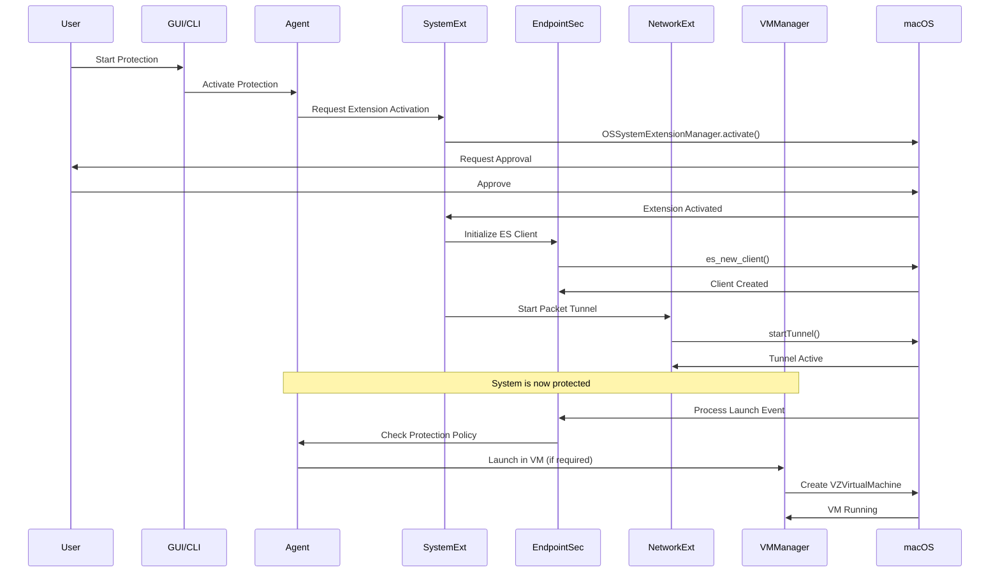

# Design Document: macOS System-Level Privacy Protection

## Overview

This design document specifies the architecture and implementation approach for enhancing Privarion with macOS system-level privacy protection capabilities. The enhancement addresses critical limitations of the current implementation by leveraging modern macOS frameworks: System Extensions, Endpoint Security Framework, Network Extensions, and Virtualization Framework.

### Current Limitations

The existing Privarion implementation faces four fundamental constraints:

1. **SIP Restrictions**: System Integrity Protection prevents kernel-level modifications and system file access
2. **DYLD Injection Scope**: Current injection mechanism only works with self-launched applications
3. **Lack of System-Wide Protection**: Requires per-application injection, leaving system-launched apps unprotected
4. **Hardware ID Spoofing Limitations**: Cannot modify hardware identifiers due to SIP protection

### Design Goals

1. **SIP Compliance**: Operate within macOS security boundaries using official Apple frameworks
2. **System-Wide Coverage**: Protect all applications regardless of launch method
3. **Hardware Isolation**: Provide true hardware fingerprinting protection through virtualization
4. **Production Ready**: Support App Store distribution with proper notarization and entitlements
5. **Performance**: Maintain system responsiveness with minimal overhead (<5% CPU, <200MB memory)
6. **Integration**: Seamlessly integrate with existing Privarion architecture (PrivarionCore, CLI, GUI)

### Technology Stack

- **System Extensions**: User-space extensions replacing kernel extensions (macOS 10.15+)
- **Endpoint Security Framework**: System-wide monitoring of processes, files, and network events
- **Network Extension Framework**: VPN-style packet tunnel and content filtering
- **Virtualization Framework**: Hardware-isolated VM environments with custom identifiers
- **Swift 5.9+**: Primary implementation language
- **C Interop**: Low-level system integration where required

## Architecture

### High-Level Architecture

The system follows a layered architecture with clear separation of concerns:

```
┌─────────────────────────────────────────────────────────────┐
│                     User Interface Layer                     │
│  ┌──────────────────┐              ┌──────────────────┐     │
│  │  PrivarionGUI    │              │   PrivacyCtl     │     │
│  │   (SwiftUI)      │              │     (CLI)        │     │
│  └────────┬─────────┘              └────────┬─────────┘     │
└───────────┼──────────────────────────────────┼──────────────┘
            │                                  │
┌───────────┼──────────────────────────────────┼──────────────┐
│           │      Application Layer           │              │
│  ┌────────▼──────────────────────────────────▼─────────┐    │
│  │           Privarion Agent (Launch Agent)            │    │
│  │  - Lifecycle Management                             │    │
│  │  - Configuration Management                         │    │
│  │  - Permission Coordination                          │    │
│  └────┬──────────────┬──────────────┬──────────────┬──┘    │
└───────┼──────────────┼──────────────┼──────────────┼───────┘
        │              │              │              │
┌───────┼──────────────┼──────────────┼──────────────┼───────┐
│       │   System Extension Layer    │              │       │
│  ┌────▼────────┐ ┌──▼──────────┐ ┌─▼────────────┐ │       │
│  │  Endpoint   │ │   Network   │ │      VM      │ │       │
│  │  Security   │ │  Extension  │ │   Manager    │ │       │
│  │  Manager    │ │  Provider   │ │              │ │       │
│  └─────────────┘ └─────────────┘ └──────────────┘ │       │
└─────────────────────────────────────────────────────────────┘
            │              │              │
┌───────────┼──────────────┼──────────────┼───────────────────┐
│           │   macOS System Frameworks    │                   │
│  ┌────────▼────────┐ ┌──▼──────────┐ ┌──▼─────────────┐    │
│  │  EndpointSecurity│ │ NetworkExt  │ │ Virtualization │    │
│  │    Framework    │ │  Framework  │ │   Framework    │    │
│  └─────────────────┘ └─────────────┘ └────────────────┘    │
└─────────────────────────────────────────────────────────────┘
```

### Component Interaction Flow



## Components and Interfaces

### 1. System Extension Manager

**Responsibility**: Manages System Extension lifecycle, installation, activation, and status monitoring.

**Module**: `PrivarionSystemExtension`

**Key Classes**:

```swift
// Main extension entry point
public class PrivarionSystemExtension: NSObject, OSSystemExtensionRequestDelegate {
    public func installExtension() async throws
    public func activateExtension() async throws
    public func deactivateExtension() async throws
    public func checkStatus() async -> ExtensionStatus
}

// Extension status
public enum ExtensionStatus {
    case notInstalled
    case installed
    case active
    case activating
    case deactivating
    case error(Error)
}

// Extension coordinator
public class SystemExtensionCoordinator {
    public func submitRequest(_ request: OSSystemExtensionRequest) async throws
    public func validateEntitlements() throws
    public func handleActivationResult(_ result: OSSystemExtensionRequest.Result)
}
```

**Interfaces**:

```swift
// Extension lifecycle protocol
public protocol SystemExtensionLifecycle {
    func willActivate() async
    func didActivate() async
    func willDeactivate() async
    func didDeactivate() async
    func didFailWithError(_ error: Error) async
}

// Extension status observer
public protocol SystemExtensionStatusObserver: AnyObject {
    func extensionStatusDidChange(_ status: ExtensionStatus)
}
```

**Integration Points**:
- Communicates with `PrivarionAgent` via XPC
- Reports status to GUI via notification center
- Logs events to `/var/log/privarion/system-extension.log`

### 2. Endpoint Security Manager

**Responsibility**: Monitors system-wide security events (process execution, file access, network connections) and applies protection policies.

**Module**: `PrivarionSystemExtension/EndpointSecurity`

**Key Classes**:

```swift
// Main ES manager
public class EndpointSecurityManager {
    private var client: OpaquePointer?
    private let eventProcessor: SecurityEventProcessor
    private let policyEngine: ProtectionPolicyEngine
    
    public func initialize() throws
    public func subscribe(to events: [es_event_type_t]) throws
    public func unsubscribe() throws
}

// Event processing
public class SecurityEventProcessor {
    func processEvent(_ message: UnsafePointer<es_message_t>) async
    func handleProcessExecution(_ event: ProcessExecutionEvent) async -> ESAuthResult
    func handleFileAccess(_ event: FileAccessEvent) async -> ESAuthResult
    func handleNetworkEvent(_ event: NetworkEvent) async -> ESAuthResult
}

// Event types
public struct ProcessExecutionEvent {
    let processID: pid_t
    let executablePath: String
    let arguments: [String]
    let environment: [String: String]
    let parentProcessID: pid_t
}

public struct FileAccessEvent {
    let processID: pid_t
    let filePath: String
    let accessType: FileAccessType
}

public enum FileAccessType {
    case read
    case write
    case execute
}

public enum ESAuthResult {
    case allow
    case deny
    case allowWithModification(Data)
}
```

**Interfaces**:

```swift
// Event handler protocol
public protocol SecurityEventHandler {
    func canHandle(_ eventType: es_event_type_t) -> Bool
    func handle(_ event: SecurityEvent) async -> ESAuthResult
}

// Policy evaluation
public protocol PolicyEvaluator {
    func evaluate(process: ProcessExecutionEvent) async -> ProtectionPolicy?
    func shouldProtect(_ executablePath: String) -> Bool
}
```

**Performance Requirements**:
- Event processing latency: <100ms for 95% of events
- Thread-safe concurrent event handling
- Event queue with backpressure handling

### 3. Network Extension Provider

**Responsibility**: Intercepts and filters all network traffic at the packet level, providing DNS filtering, tracking domain blocking, and telemetry prevention.

**Module**: `PrivarionNetworkExtension`

**Key Classes**:

```swift
// Packet tunnel provider
public class PrivarionPacketTunnelProvider: NEPacketTunnelProvider {
    private let dnsFilter: DNSFilter
    private let packetFilter: PacketFilter
    private let telemetryBlocker: TelemetryBlocker
    
    public override func startTunnel(options: [String: NSObject]?) async throws
    public override func stopTunnel(with reason: NEProviderStopReason) async
    private func processPackets() async
}

// DNS filtering
public class DNSFilter {
    private let blocklistManager: BlocklistManager
    private let cache: DNSCache
    
    func filterDNSQuery(_ query: DNSQuery) async -> DNSResponse
    func isBlocked(_ domain: String) -> Bool
    func isFingerprintingDomain(_ domain: String) -> Bool
    func createFakeResponse(for query: DNSQuery) -> DNSResponse
}

// Packet filtering
public class PacketFilter {
    func filterPacket(_ packet: Data, protocol: Int) async -> FilterResult
    func extractDestination(_ packet: Data) -> NetworkDestination?
}

public enum FilterResult {
    case allow(Data)
    case drop
    case modify(Data)
}

// Content filter provider
public class PrivarionContentFilterProvider: NEFilterDataProvider {
    public override func handleNewFlow(_ flow: NEFilterFlow) -> NEFilterNewFlowVerdict
    public override func handleInboundData(from flow: NEFilterFlow, 
                                          readBytesStartOffset offset: Int,
                                          readBytes: Data) -> NEFilterDataVerdict
    public override func handleOutboundData(from flow: NEFilterFlow,
                                           readBytesStartOffset offset: Int,
                                           readBytes: Data) -> NEFilterDataVerdict
}
```

**Interfaces**:

```swift
// Filter rule protocol
public protocol FilterRule {
    func matches(_ flow: NEFilterFlow) -> Bool
    func verdict(for flow: NEFilterFlow) -> NEFilterNewFlowVerdict
}

// DNS cache protocol
public protocol DNSCacheProtocol {
    func get(_ domain: String) -> DNSResponse?
    func set(_ domain: String, response: DNSResponse, ttl: TimeInterval)
    func clear()
}
```

**Performance Requirements**:
- Packet processing latency: <10ms for 95% of packets
- DNS query processing: <50ms for cached entries, <200ms for non-cached
- Connection pooling for upstream DNS queries

### 4. VM Manager

**Responsibility**: Creates and manages isolated virtual machine environments with custom hardware identifiers for applications requiring maximum privacy protection.

**Module**: `PrivarionVM`

**Key Classes**:

```swift
// VM lifecycle management
public class VMManager {
    private var activeVMs: [UUID: VZVirtualMachine]
    private let configurationBuilder: VMConfigurationBuilder
    private let resourceManager: VMResourceManager
    
    public func createVM(with profile: HardwareProfile) async throws -> VZVirtualMachine
    public func startVM(_ vmID: UUID) async throws
    public func stopVM(_ vmID: UUID) async throws
    public func installApplication(_ appURL: URL, in vmID: UUID) async throws
    public func snapshot(_ vmID: UUID) async throws -> VMSnapshot
    public func restore(_ snapshot: VMSnapshot) async throws
}

// VM configuration
public class VMConfigurationBuilder {
    func buildConfiguration(profile: HardwareProfile) throws -> VZVirtualMachineConfiguration
    func createPlatformConfiguration(_ profile: HardwareProfile) -> VZMacPlatformConfiguration
    func createNetworkDevice(macAddress: String) -> VZVirtioNetworkDeviceConfiguration
    func createStorageDevice(size: UInt64) throws -> VZVirtioBlockDeviceConfiguration
}

// Resource management
public class VMResourceManager {
    func allocateResources(for vm: VZVirtualMachine) throws
    func releaseResources(for vm: VZVirtualMachine)
    func enforceResourceLimits(_ vm: VZVirtualMachine)
    func getResourceUsage(_ vmID: UUID) -> VMResourceUsage
}

public struct VMResourceUsage {
    let cpuUsage: Double // 0.0 to 1.0
    let memoryUsage: UInt64 // bytes
    let diskUsage: UInt64 // bytes
    let networkBytesIn: UInt64
    let networkBytesOut: UInt64
}
```

**Interfaces**:

```swift
// VM lifecycle observer
public protocol VMLifecycleObserver: AnyObject {
    func vmDidStart(_ vmID: UUID)
    func vmDidStop(_ vmID: UUID)
    func vmDidCrash(_ vmID: UUID, error: Error)
}

// Hardware profile protocol
public protocol HardwareProfileProtocol {
    var hardwareModel: Data { get }
    var machineIdentifier: Data { get }
    var macAddress: String { get }
    var serialNumber: String { get }
    func validate() throws
}
```

**Resource Limits**:
- CPU: 50% of host CPU cores
- Memory: 50% of host memory
- Disk: Configurable per VM (default 50GB)

### 5. Privarion Agent

**Responsibility**: Background service that coordinates all system-level protection components, manages configuration, and handles permission requests.

**Module**: `PrivarionAgent`

**Key Classes**:

```swift
// Main agent
public class PrivarionAgent {
    private let extensionManager: SystemExtensionCoordinator
    private let endpointSecurity: EndpointSecurityManager
    private let networkExtension: NetworkExtensionCoordinator
    private let vmManager: VMManager
    private let configManager: ConfigurationManager
    private let permissionManager: PermissionManager
    
    public func start() async throws
    public func stop() async throws
    public func restart() async throws
    public func getStatus() async -> AgentStatus
}

// Permission management
public class PermissionManager {
    func checkSystemExtensionPermission() -> PermissionStatus
    func checkFullDiskAccessPermission() -> PermissionStatus
    func checkNetworkExtensionPermission() -> PermissionStatus
    func requestPermission(_ type: PermissionType) async throws
    func openSystemPreferences(for permission: PermissionType)
}

public enum PermissionType {
    case systemExtension
    case fullDiskAccess
    case networkExtension
}

public enum PermissionStatus {
    case granted
    case denied
    case notDetermined
}

// Agent status
public struct AgentStatus {
    let isRunning: Bool
    let systemExtensionStatus: ExtensionStatus
    let endpointSecurityActive: Bool
    let networkExtensionActive: Bool
    let activeVMCount: Int
    let permissions: [PermissionType: PermissionStatus]
}
```

**Launch Agent Configuration**:

```xml
<?xml version="1.0" encoding="UTF-8"?>
<!DOCTYPE plist PUBLIC "-//Apple//DTD PLIST 1.0//EN" 
  "http://www.apple.com/DTDs/PropertyList-1.0.dtd">
<plist version="1.0">
<dict>
    <key>Label</key>
    <string>com.privarion.agent</string>
    <key>ProgramArguments</key>
    <array>
        <string>/Applications/Privarion.app/Contents/MacOS/PrivarionAgent</string>
    </array>
    <key>RunAtLoad</key>
    <true/>
    <key>KeepAlive</key>
    <true/>
    <key>StandardOutPath</key>
    <string>/var/log/privarion/agent.log</string>
    <key>StandardErrorPath</key>
    <string>/var/log/privarion/agent-error.log</string>
</dict>
</plist>
```

### 6. Protection Policy Engine

**Responsibility**: Evaluates and applies protection policies to applications based on configurable rules.

**Module**: `PrivarionCore/PolicyEngine`

**Key Classes**:

```swift
// Policy engine (extends existing PrivarionCore)
public class ProtectionPolicyEngine {
    private var policies: [String: ProtectionPolicy]
    private let defaultPolicy: ProtectionPolicy
    
    func evaluatePolicy(for executablePath: String) -> ProtectionPolicy
    func addPolicy(_ policy: ProtectionPolicy)
    func removePolicy(identifier: String)
    func loadPolicies(from url: URL) throws
}

// Protection policy
public struct ProtectionPolicy: Codable {
    let identifier: String // bundle ID or path
    let protectionLevel: ProtectionLevel
    let networkFiltering: NetworkFilteringRules
    let dnsFiltering: DNSFilteringRules
    let hardwareSpoofing: HardwareSpoofingLevel
    let requiresVMIsolation: Bool
    let parentPolicy: String? // for inheritance
}

public enum ProtectionLevel: String, Codable {
    case none
    case basic
    case standard
    case strict
    case paranoid
}

public struct NetworkFilteringRules: Codable {
    let action: FilterAction
    let allowedDomains: [String]
    let blockedDomains: [String]
}

public struct DNSFilteringRules: Codable {
    let action: FilterAction
    let blockTracking: Bool
    let blockFingerprinting: Bool
    let customBlocklist: [String]
}

public enum FilterAction: String, Codable {
    case allow
    case block
    case monitor
}

public enum HardwareSpoofingLevel: String, Codable {
    case none
    case basic // software-level spoofing
    case full  // VM-based isolation
}
```

### 7. Hardware Profile Manager

**Responsibility**: Manages hardware identity profiles for VM creation and spoofing.

**Module**: `PrivarionCore/HardwareProfile`

**Key Classes**:

```swift
// Hardware profile (extends existing HardwareIdentifierEngine)
public struct HardwareProfile: Codable, HardwareProfileProtocol {
    let id: UUID
    let name: String
    let hardwareModel: Data
    let machineIdentifier: Data
    let macAddress: String
    let serialNumber: String
    let createdAt: Date
    
    func validate() throws
    static func predefinedProfiles() -> [HardwareProfile]
}

// Profile manager
public class HardwareProfileManager {
    private var profiles: [UUID: HardwareProfile]
    
    func createProfile(name: String, template: ProfileTemplate) throws -> HardwareProfile
    func getProfile(id: UUID) -> HardwareProfile?
    func listProfiles() -> [HardwareProfile]
    func deleteProfile(id: UUID) throws
    func exportProfile(_ id: UUID) throws -> Data
    func importProfile(_ data: Data) throws -> HardwareProfile
}

public enum ProfileTemplate {
    case macBookPro2021
    case macBookAir2022
    case iMac2021
    case macMini2023
    case macStudio2022
    case custom
}
```

### 8. Telemetry Blocker

**Responsibility**: Identifies and blocks application telemetry and analytics traffic.

**Module**: `PrivarionCore/TelemetryBlocker`

**Key Classes**:

```swift
// Telemetry detection and blocking
public class TelemetryBlocker {
    private let telemetryDatabase: TelemetryDatabase
    private let patternMatcher: TelemetryPatternMatcher
    
    func shouldBlock(_ request: NetworkRequest) -> Bool
    func detectTelemetryPattern(in data: Data) -> TelemetryPattern?
    func updateDatabase() async throws
}

// Telemetry database
public class TelemetryDatabase {
    private var endpoints: Set<String>
    private var patterns: [TelemetryPattern]
    
    func isKnownTelemetryEndpoint(_ domain: String) -> Bool
    func addEndpoint(_ domain: String)
    func removeEndpoint(_ domain: String)
    func loadFromRemote() async throws
}

// Pattern matching
public struct TelemetryPattern {
    let type: TelemetryType
    let domainPattern: String
    let pathPattern: String?
    let headerPatterns: [String: String]
    let payloadPattern: String?
}

public enum TelemetryType {
    case analytics
    case tracking
    case crashReporting
    case usageStatistics
}
```

### 9. Transparent Proxy

**Responsibility**: Provides system-wide transparent proxying for DNS, HTTP, and HTTPS traffic.

**Module**: `PrivarionCore/TransparentProxy`

**Key Classes**:

```swift
// Transparent proxy coordinator
public class TransparentProxyCoordinator {
    private let dnsProxy: DNSProxyServer // existing
    private let httpProxy: HTTPProxyServer
    private let httpsProxy: HTTPSProxyServer
    private let networkSettings: NetworkSettingsManager
    
    func start() async throws
    func stop() async throws
    func getStatus() -> ProxyStatus
}

// Network settings management
public class NetworkSettingsManager {
    private var originalSettings: NetworkSettings?
    
    func configureSystemProxy() throws
    func restoreOriginalSettings() throws
    func backupCurrentSettings() throws
    func getActiveInterfaces() -> [NetworkInterface]
}

public struct NetworkSettings {
    let interfaces: [NetworkInterface]
    let dnsServers: [String]
    let webProxy: ProxyConfiguration?
    let secureWebProxy: ProxyConfiguration?
}

public struct ProxyConfiguration {
    let host: String
    let port: Int
    let enabled: Bool
}
```

### 10. Configuration Manager

**Responsibility**: Parses, validates, and manages system configuration.

**Module**: `PrivarionCore/Configuration` (extends existing)

**Key Classes**:

```swift
// Configuration parser
public class SystemExtensionConfigurationManager {
    private let configPath: URL
    private var currentConfig: SystemExtensionConfiguration?
    
    func loadConfiguration() throws -> SystemExtensionConfiguration
    func validateConfiguration(_ config: SystemExtensionConfiguration) throws
    func saveConfiguration(_ config: SystemExtensionConfiguration) throws
    func reloadConfiguration() throws
    func exportConfiguration() throws -> Data
    func importConfiguration(_ data: Data) throws
}

// Configuration structure
public struct SystemExtensionConfiguration: Codable {
    let version: String
    let policies: [ProtectionPolicy]
    let hardwareProfiles: [HardwareProfile]
    let blocklists: BlocklistConfiguration
    let networkSettings: NetworkConfiguration
    let loggingSettings: LoggingConfiguration
}

public struct BlocklistConfiguration: Codable {
    let trackingDomains: [String]
    let fingerprintingDomains: [String]
    let telemetryEndpoints: [String]
    let customBlocklist: [String]
}

public struct NetworkConfiguration: Codable {
    let dnsProxyPort: Int
    let httpProxyPort: Int
    let httpsProxyPort: Int
    let upstreamDNS: [String]
    let enableDoH: Bool
}

public struct LoggingConfiguration: Codable {
    let level: LogLevel
    let rotationDays: Int
    let maxSizeMB: Int
    let sanitizePII: Bool
}

public enum LogLevel: String, Codable {
    case debug
    case info
    case warning
    case error
    case critical
}
```

## Data Models

### Core Data Structures

```swift
// Security event
public struct SecurityEvent {
    let id: UUID
    let timestamp: Date
    let type: SecurityEventType
    let processID: pid_t
    let executablePath: String
    let action: SecurityAction
    let result: ESAuthResult
}

public enum SecurityEventType {
    case processExecution
    case fileAccess
    case networkConnection
    case dnsQuery
}

public enum SecurityAction {
    case allow
    case deny
    case monitor
    case modify
}

// Network request
public struct NetworkRequest {
    let id: UUID
    let timestamp: Date
    let processID: pid_t
    let sourceIP: String
    let sourcePort: Int
    let destinationIP: String
    let destinationPort: Int
    let protocol: NetworkProtocol
    let domain: String?
}

public enum NetworkProtocol {
    case tcp
    case udp
    case icmp
}

// DNS query/response
public struct DNSQuery {
    let id: UInt16
    let domain: String
    let queryType: DNSQueryType
    let timestamp: Date
}

public struct DNSResponse {
    let id: UInt16
    let domain: String
    let addresses: [String]
    let ttl: TimeInterval
    let cached: Bool
}

public enum DNSQueryType: UInt16 {
    case A = 1
    case AAAA = 28
    case CNAME = 5
    case MX = 15
}

// VM snapshot
public struct VMSnapshot {
    let id: UUID
    let vmID: UUID
    let timestamp: Date
    let name: String
    let diskImagePath: URL
    let memoryStatePath: URL
    let configuration: VZVirtualMachineConfiguration
}
```

### Persistence

Configuration and state are persisted using JSON files:

- **Configuration**: `/Library/Application Support/Privarion/config.json`
- **Policies**: `/Library/Application Support/Privarion/policies.json`
- **Hardware Profiles**: `/Library/Application Support/Privarion/profiles.json`
- **Blocklists**: `/Library/Application Support/Privarion/blocklists.json`
- **VM State**: `/Library/Application Support/Privarion/vms/`

Logs are written to:
- **System Extension**: `/var/log/privarion/system-extension.log`
- **Agent**: `/var/log/privarion/agent.log`
- **Network Extension**: `/var/log/privarion/network-extension.log`
- **VM Manager**: `/var/log/privarion/vm-manager.log`


## Error Handling

### Error Handling Strategy

The system implements a comprehensive error handling strategy with graceful degradation, automatic recovery, and clear user communication.

### Error Categories

```swift
// System extension errors
public enum SystemExtensionError: Error {
    case installationFailed(reason: String)
    case activationFailed(OSSystemExtensionError.Code)
    case entitlementMissing(String)
    case notarization Failed
    case userDeniedApproval
    case incompatibleMacOSVersion
}

// Endpoint security errors
public enum EndpointSecurityError: Error {
    case clientInitializationFailed(es_new_client_result_t)
    case subscriptionFailed(es_event_type_t)
    case fullDiskAccessDenied
    case eventProcessingTimeout
    case clientDisconnected
}

// Network extension errors
public enum NetworkExtensionError: Error {
    case tunnelStartFailed(Error)
    case tunnelConfigurationInvalid
    case packetProcessingFailed
    case dnsProxyBindFailed(port: Int)
    case networkSettingsRestoreFailed
}

// VM errors
public enum VMError: Error {
    case configurationInvalid(String)
    case resourceAllocationFailed
    case vmStartFailed(Error)
    case vmCrashed(reason: String)
    case snapshotFailed
    case diskImageCorrupted
}

// Configuration errors
public enum ConfigurationError: Error {
    case fileNotFound(URL)
    case parseError(line: Int, message: String)
    case validationFailed([String])
    case schemaVersionMismatch
}
```

### Error Recovery Patterns

#### 1. Retry with Exponential Backoff

```swift
public class RetryPolicy {
    let maxAttempts: Int
    let baseDelay: TimeInterval
    let maxDelay: TimeInterval
    
    func execute<T>(_ operation: () async throws -> T) async throws -> T {
        var attempt = 0
        var delay = baseDelay
        
        while attempt < maxAttempts {
            do {
                return try await operation()
            } catch {
                attempt += 1
                if attempt >= maxAttempts {
                    throw error
                }
                try await Task.sleep(nanoseconds: UInt64(delay * 1_000_000_000))
                delay = min(delay * 2, maxDelay)
            }
        }
        fatalError("Unreachable")
    }
}
```

**Applied to**:
- Endpoint Security client initialization (3 attempts, 1s base delay)
- Network Extension tunnel start (3 attempts, 2s base delay)
- VM creation (2 attempts, 5s base delay)

#### 2. Circuit Breaker Pattern

```swift
public class CircuitBreaker {
    private var state: CircuitState
    private var failureCount: Int
    private let threshold: Int
    private let timeout: TimeInterval
    
    enum CircuitState {
        case closed
        case open(until: Date)
        case halfOpen
    }
    
    func execute<T>(_ operation: () async throws -> T) async throws -> T {
        switch state {
        case .open(let until):
            if Date() < until {
                throw CircuitBreakerError.circuitOpen
            }
            state = .halfOpen
            fallthrough
            
        case .halfOpen, .closed:
            do {
                let result = try await operation()
                if case .halfOpen = state {
                    state = .closed
                    failureCount = 0
                }
                return result
            } catch {
                failureCount += 1
                if failureCount >= threshold {
                    state = .open(until: Date().addingTimeInterval(timeout))
                }
                throw error
            }
        }
    }
}
```

**Applied to**:
- DNS upstream queries (5 failures, 60s timeout)
- Telemetry database updates (3 failures, 300s timeout)
- VM operations (3 failures, 120s timeout)

#### 3. Graceful Degradation

When components fail, the system continues operating with reduced functionality:

| Component Failure | Degraded Behavior |
|------------------|-------------------|
| Endpoint Security | Continue with Network Extension only, log warning |
| Network Extension | Continue with Endpoint Security only, disable network filtering |
| VM Manager | Disable VM isolation, use software-level spoofing |
| DNS Proxy | Fall back to system DNS, disable DNS filtering |
| Configuration Load | Use last known good configuration or defaults |

```swift
public class GracefulDegradationManager {
    private var activeComponents: Set<ComponentType>
    private var degradedComponents: Set<ComponentType>
    
    func handleComponentFailure(_ component: ComponentType, error: Error) {
        degradedComponents.insert(component)
        activeComponents.remove(component)
        
        // Log degradation
        logger.warning("Component \(component) degraded: \(error)")
        
        // Notify user
        notifyUserOfDegradation(component)
        
        // Attempt recovery after timeout
        scheduleRecoveryAttempt(component)
    }
    
    func attemptRecovery(_ component: ComponentType) async {
        do {
            try await restartComponent(component)
            degradedComponents.remove(component)
            activeComponents.insert(component)
            logger.info("Component \(component) recovered")
        } catch {
            logger.error("Recovery failed for \(component): \(error)")
        }
    }
}
```

### Error Logging and Reporting

All errors are logged with structured information:

```swift
public struct ErrorLogEntry {
    let timestamp: Date
    let component: String
    let errorType: String
    let message: String
    let stackTrace: String?
    let context: [String: String]
    let severity: ErrorSeverity
}

public enum ErrorSeverity {
    case recoverable
    case degraded
    case critical
}
```

Critical errors trigger user notifications with recovery instructions:

```swift
public struct ErrorNotification {
    let title: String
    let message: String
    let recoverySteps: [String]
    let canAutoRecover: Bool
    let supportLink: URL?
}
```

### Resource Cleanup

All components implement proper resource cleanup:

```swift
public protocol ResourceCleanup {
    func cleanup() async throws
}

// Example: Network Extension cleanup
extension PrivarionPacketTunnelProvider: ResourceCleanup {
    public func cleanup() async throws {
        // Stop packet processing
        stopPacketLoop()
        
        // Restore network settings
        try await networkSettings.restoreOriginalSettings()
        
        // Close connections
        await closeAllConnections()
        
        // Release resources
        releaseResources()
    }
}
```

## Testing Strategy

### Testing Approach

The system employs a dual testing strategy combining unit tests for specific examples and property-based tests for universal correctness properties.

### Unit Testing

**Scope**: Specific examples, edge cases, error conditions, and integration points.

**Framework**: XCTest

**Coverage Target**: 80% code coverage minimum

**Test Organization**:

```
Tests/
├── PrivarionSystemExtensionTests/
│   ├── SystemExtensionManagerTests.swift
│   ├── EndpointSecurityManagerTests.swift
│   └── Mocks/
├── PrivarionNetworkExtensionTests/
│   ├── PacketTunnelProviderTests.swift
│   ├── DNSFilterTests.swift
│   ├── ContentFilterTests.swift
│   └── Mocks/
├── PrivarionVMTests/
│   ├── VMManagerTests.swift
│   ├── HardwareProfileTests.swift
│   └── Mocks/
└── IntegrationTests/
    ├── EndToEndProtectionTests.swift
    ├── PermissionFlowTests.swift
    └── MigrationTests.swift
```

**Example Unit Tests**:

```swift
class EndpointSecurityManagerTests: XCTestCase {
    func testClientInitializationSuccess() async throws {
        let manager = EndpointSecurityManager()
        try await manager.initialize()
        XCTAssertTrue(manager.isActive)
    }
    
    func testProcessExecutionEventHandling() async throws {
        let manager = EndpointSecurityManager()
        let event = createMockProcessEvent(path: "/usr/bin/safari")
        let result = await manager.handleProcessExecution(event)
        XCTAssertEqual(result, .allow)
    }
    
    func testBlockedProcessDenied() async throws {
        let manager = EndpointSecurityManager()
        let policy = ProtectionPolicy(identifier: "com.blocked.app", 
                                      protectionLevel: .paranoid,
                                      requiresVMIsolation: true)
        manager.addPolicy(policy)
        
        let event = createMockProcessEvent(path: "/Applications/BlockedApp.app")
        let result = await manager.handleProcessExecution(event)
        XCTAssertEqual(result, .deny)
    }
}

class DNSFilterTests: XCTestCase {
    func testTrackingDomainBlocked() {
        let filter = DNSFilter()
        filter.addToBlocklist("analytics.example.com")
        
        let query = DNSQuery(id: 1, domain: "analytics.example.com", 
                            queryType: .A, timestamp: Date())
        let response = filter.filterDNSQuery(query)
        
        XCTAssertEqual(response.addresses, [])
        XCTAssertTrue(response.isBlocked)
    }
    
    func testFingerprintingDomainFaked() {
        let filter = DNSFilter()
        let query = DNSQuery(id: 2, domain: "fingerprint.tracker.com",
                            queryType: .A, timestamp: Date())
        let response = filter.filterDNSQuery(query)
        
        XCTAssertFalse(response.addresses.isEmpty)
        XCTAssertTrue(response.isFake)
    }
}
```

### Property-Based Testing

**Scope**: Universal properties that hold for all inputs.

**Framework**: swift-check (QuickCheck-style property testing for Swift)

**Configuration**: Minimum 100 iterations per property test

**Test Tagging**: Each property test references its design document property

```swift
import SwiftCheck

class ConfigurationPropertyTests: XCTestCase {
    // Feature: macos-system-level-privacy-protection, Property 1
    func testConfigurationRoundTrip() {
        property("Parsing then printing configuration produces equivalent object") 
            <- forAll { (config: SystemExtensionConfiguration) in
                let json = try! JSONEncoder().encode(config)
                let parsed = try! JSONDecoder().decode(SystemExtensionConfiguration.self, 
                                                       from: json)
                return config == parsed
            }
    }
}

class DNSFilterPropertyTests: XCTestCase {
    // Feature: macos-system-level-privacy-protection, Property 2
    func testDNSFilteringIdempotence() {
        property("Filtering a query twice produces same result as filtering once")
            <- forAll { (query: DNSQuery) in
                let filter = DNSFilter()
                let result1 = filter.filterDNSQuery(query)
                let result2 = filter.filterDNSQuery(query)
                return result1 == result2
            }
    }
}
```

### Integration Testing

**Scope**: Complete workflows across multiple components.

**Test Scenarios**:

1. **Extension Installation Flow**
   - Request installation → User approval → Extension activation → Verification

2. **Process Protection Flow**
   - Process launch → Policy evaluation → Protection application → Verification

3. **Network Filtering Flow**
   - Network request → Packet interception → Filtering → Response verification

4. **VM Isolation Flow**
   - VM creation → Application installation → Execution → Hardware verification

5. **Permission Request Flow**
   - Permission check → Request → User grant → Verification

6. **Configuration Migration Flow**
   - Detect old config → Parse → Transform → Validate → Apply

### Compatibility Testing

**macOS Versions**: 13.0 (Ventura), 14.0 (Sonoma), 15.0 (Sequoia)

**Network Configurations**:
- Wi-Fi
- Ethernet
- USB tethering
- VPN active
- Multiple interfaces

**Applications**:
- Safari
- Chrome
- Firefox
- Native macOS apps (Mail, Messages, etc.)
- Third-party apps

### Performance Benchmarking

**Critical Paths**:

```swift
class PerformanceBenchmarks: XCTestCase {
    func testEventProcessingLatency() {
        measure {
            let manager = EndpointSecurityManager()
            let event = createMockProcessEvent()
            _ = await manager.handleProcessExecution(event)
        }
        // Assert: 95th percentile < 100ms
    }
    
    func testPacketProcessingLatency() {
        measure {
            let provider = PrivarionPacketTunnelProvider()
            let packet = createMockPacket()
            _ = await provider.filterPacket(packet)
        }
        // Assert: 95th percentile < 10ms
    }
    
    func testDNSQueryLatency() {
        measure {
            let filter = DNSFilter()
            let query = createMockDNSQuery()
            _ = filter.filterDNSQuery(query)
        }
        // Assert: cached < 50ms, non-cached < 200ms
    }
}
```

### Mock Objects

All external dependencies are mocked for testing:

```swift
// Mock Endpoint Security client
class MockESClient: EndpointSecurityClient {
    var subscribedEvents: [es_event_type_t] = []
    var eventHandler: ((UnsafePointer<es_message_t>) -> Void)?
    
    func subscribe(to events: [es_event_type_t]) throws {
        subscribedEvents.append(contentsOf: events)
    }
    
    func simulateEvent(_ event: es_message_t) {
        var mutableEvent = event
        withUnsafePointer(to: &mutableEvent) { ptr in
            eventHandler?(ptr)
        }
    }
}

// Mock VM
class MockVirtualMachine: VirtualMachineProtocol {
    var isRunning: Bool = false
    var configuration: VZVirtualMachineConfiguration
    
    func start() async throws {
        isRunning = true
    }
    
    func stop() async throws {
        isRunning = false
    }
}
```

