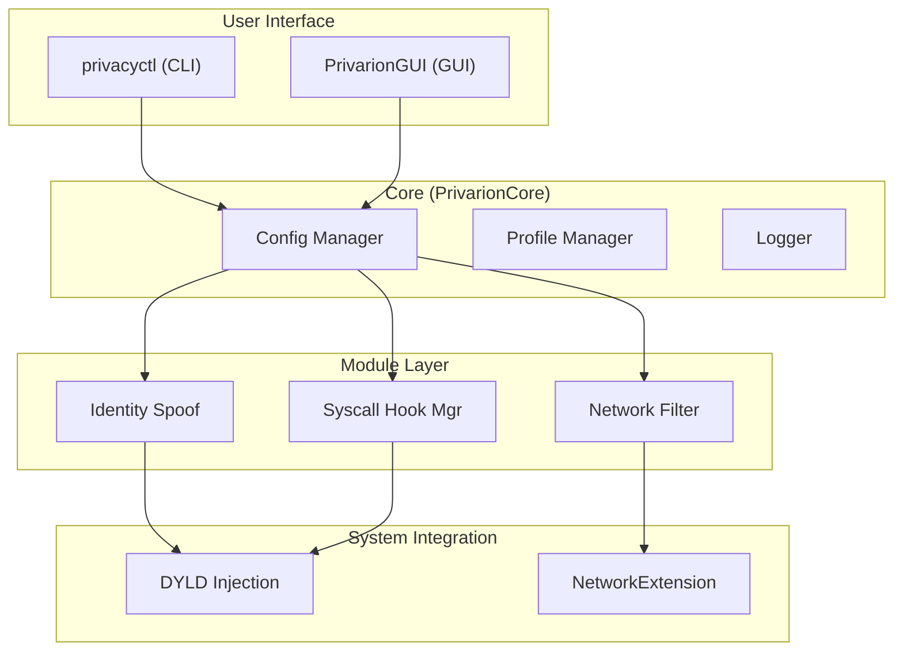

# Privarion: Comprehensive Privacy Protection System for macOS

**Privarion** is an open-source, modular privacy protection tool for macOS that prevents applications from fingerprinting your device and collecting personal information. Our goal is to provide users with a privacy-focused computing experience by protecting their digital identity.

---

## Key Features

- **Identity Spoofing**: Randomizes or spoofs hardware and software-based identifiers (MAC address, serial number, disk UUID, etc.) based on profiles.
- **Network Filtering**: Blocks network traffic to telemetry, advertising, and tracking servers.
- **System Hooks (Syscall Hooking)**: Intercepts low-level system calls to manipulate how applications access sensitive information.
- **Modular Architecture**: Each protection mechanism operates as an independent module and can be enabled as needed.
- **Centralized Management**: Provides both a command-line interface (CLI) and a user-friendly SwiftUI-based graphical interface (GUI).
- **Profiles**: Easily switch between pre-configured or custom-created profiles for different privacy scenarios.
- **Rollback**: Snapshot system that ensures all changes can be safely reverted.

---

## System Architecture

Privarion is built on a layered and modular architecture. This structure provides flexibility, extensibility, and ease of maintenance.



- **User Interface**: Consists of two main components: `privacyctl` (CLI) and `PrivarionGUI` (GUI).
- **PrivarionCore**: The central logic layer where all modules and settings are managed.
- **Modules**: Independent units that perform specific tasks such as identity spoofing and network filtering.
- **System Integration**: Implements protection mechanisms by interacting with macOS's low-level APIs.

---

## Installation

Follow these steps to build and run the project:

**Requirements:**
- macOS 13.0 (Ventura) or later
- Xcode 14.3 or later
- Swift 5.9

**Build Steps:**

1.  **Clone the project:**
    ```sh
    git clone https://github.com/privarion/privarion.git
    cd privarion
    ```

2.  **Install dependencies:**
    Swift Package Manager will automatically resolve dependencies.

3.  **Build the project:**
    ```sh
    swift build -c release
    ```
    This will build both the `privacyctl` CLI tool and the `PrivarionGUI.app` application.

4.  **Install the application (optional):**
    You can copy the built products to `/usr/local/bin` and `/Applications`:
    ```sh
    cp .build/release/privacyctl /usr/local/bin/
    cp -R .build/release/PrivarionGUI.app /Applications/
    ```

---

## Usage

You can manage Privarion from both the command line and the graphical interface.

### Command-Line Interface (CLI)

The `privacyctl` tool provides a powerful interface to manage all features.

**Basic Commands:**

- **Check status:**
  ```sh
  sudo privacyctl status
  ```

- **Start identity spoofing:**
  ```sh
  sudo privacyctl spoof --all
  ```

- **Enable a specific profile:**
  ```sh
  sudo privacyctl profile switch --name "work-profile"
  ```

- **List all profiles:**
  ```sh
  privacyctl profile list
  ```

- **Enable network filtering:**
  ```sh
  sudo privacyctl network enable
  ```

- **Help:**
  ```sh
  privacyctl --help
  ```

### Graphical User Interface (GUI)

The `PrivarionGUI.app` application allows you to manage all features through a visual interface. Launch the app from `/Applications`.

- **Dashboard**: Shows overall system status and active protections.
- **Modules**: Configure each protection module individually.
- **Profiles**: Manage profiles, create new ones, and switch between them.
- **Logs**: Monitor system logs in real-time.

---

## Development

If you'd like to contribute to the project, follow these steps.

1.  **Open the project in Xcode:**
    ```sh
    xed .
    ```
    or
    ```sh
    open Package.swift
    ```

2.  **Select a scheme:**
    - Select the `PrivacyCtl` scheme to work on the CLI.
    - Select the `PrivarionGUI` scheme to work on the GUI.

3.  **Run tests:**
    To run all tests in the project:
    ```sh
    swift test
    ```

---

## Tests

The project aims for high code quality with unit and integration tests.

- **PrivarionCoreTests**: Tests the core library logic.
- **PrivacyCtlTests**: Tests CLI command correctness.
- **PrivarionGUITests**: Tests GUI component behaviors.
- **PrivarionHookTests**: Validates the functionality of low-level C hooks.

---

## Contributing

We welcome contributions! Please see the [CONTRIBUTING.md](CONTRIBUTING.md) file for guidelines.

1.  Fork the project.
2.  Create a feature branch (`git checkout -b feature/amazing-feature`).
3.  Commit your changes (`git commit -am 'Add amazing feature'`).
4.  Push to the branch (`git push origin feature/amazing-feature`).
5.  Create a Pull Request.

---

## License

This project is licensed under the MIT License. See the project repository for details.
