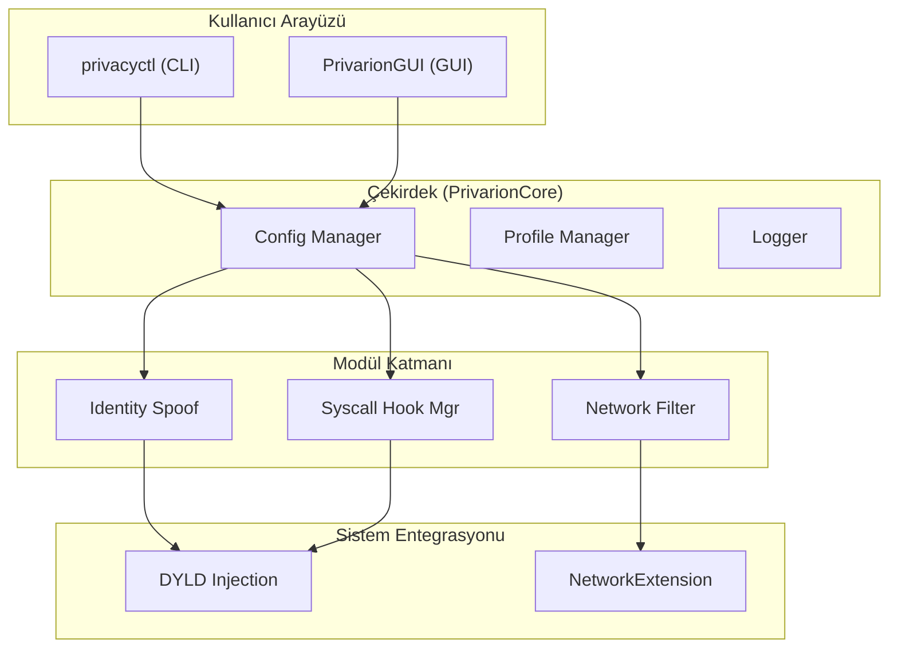

# Privarion: macOS için Kapsamlı Gizlilik Koruma Sistemi

 <!-- Placeholder, gerçek logo ile değiştirilecek -->

**Privarion**, macOS işletim sisteminde çalışan uygulamaların sizi ve cihazınızı tanımasını (fingerprinting) engelleyen, açık kaynaklı ve modüler bir gizlilik koruma aracıdır. Amacımız, kullanıcıların dijital kimliklerini koruyarak onlara gizlilik odaklı bir bilgisayar kullanım deneyimi sunmaktır.

---

## ✨ Temel Özellikler

- **Kimlik Sahteleme (Identity Spoofing):** Donanım ve yazılım tabanlı tanımlayıcıları (MAC adresi, seri numarası, disk UUID'si vb.) rastgele veya belirli profillere göre değiştirir.
- **Ağ Filtreleme:** Telemetri, reklam ve izleme sunucularına giden ağ trafiğini engeller.
- **Sistem Kancaları (Syscall Hooking):** Düşük seviyeli sistem çağrılarını yakalayarak uygulamaların hassas bilgilere erişimini manipüle eder.
- **Modüler Mimari:** Her bir koruma mekanizması bağımsız bir modül olarak çalışır ve isteğe bağlı olarak etkinleştirilebilir.
- **Merkezi Yönetim:** Hem komut satırı arayüzü (CLI) hem de kullanıcı dostu bir SwiftUI tabanlı arayüz (GUI) sunar.
- **Profiller:** Farklı gizlilik senaryoları için önceden yapılandırılmış veya özel olarak oluşturulmuş profiller arasında kolayca geçiş yapın.
- **Geri Alma (Rollback):** Yapılan tüm değişikliklerin güvenli bir şekilde geri alınmasını sağlayan anlık görüntü (snapshot) sistemi.

---

## 🏗️ Sistem Mimarisi

Privarion, katmanlı ve modüler bir mimari üzerine inşa edilmiştir. Bu yapı, esneklik, genişletilebilirlik ve bakım kolaylığı sağlar.



- **Kullanıcı Arayüzü:** `privacyctl` (CLI) ve `PrivarionGUI` (GUI) olmak üzere iki ana bileşenden oluşur.
- **PrivarionCore:** Tüm modüllerin ve ayarların yönetildiği merkezi mantık katmanıdır.
- **Modüller:** Kimlik sahteleme, ağ filtreleme gibi özel görevleri yerine getiren bağımsız birimlerdir.
- **Sistem Entegrasyonu:** macOS'in düşük seviyeli API'leri ile etkileşim kurarak koruma mekanizmalarını uygular.

---

## 🚀 Kurulum

Projeyi derlemek ve çalıştırmak için aşağıdaki adımları izleyin:

**Gereksinimler:**
- macOS 13.0 (Ventura) veya üstü
- Xcode 14.3 veya üstü
- Swift 5.9

**Derleme Adımları:**

1.  **Projeyi klonlayın:**
    ```sh
    git clone https://github.com/your-username/privarion.git
    cd privarion
    ```

2.  **Bağımlılıkları yükleyin:**
    Swift Package Manager, bağımlılıkları otomatik olarak çözecektir.

3.  **Projeyi derleyin:**
    ```sh
    swift build -c release
    ```
    Bu komut, hem `privacyctl` CLI aracını hem de `PrivarionGUI.app` uygulamasını derleyecektir.

4.  **Uygulamayı yükleyin (opsiyonel):**
    Derlenen ürünleri `/usr/local/bin` ve `/Applications` dizinine kopyalayabilirsiniz.
    ```sh
    cp .build/release/privacyctl /usr/local/bin/
    cp -R .build/release/PrivarionGUI.app /Applications/
    ```

---

## 🛠️ Kullanım

Privarion'u hem komut satırından hem de grafik arayüzden yönetebilirsiniz.

### Komut Satırı Arayüzü (CLI)

`privacyctl` aracı, tüm özellikleri yönetmek için güçlü bir arayüz sunar.

**Temel Komutlar:**

- **Durumu kontrol et:**
  ```sh
  sudo privacyctl status
  ```

- **Kimlik sahteleme işlemini başlat:**
  ```sh
  sudo privacyctl spoof --all
  ```

- **Belirli bir profili etkinleştir:**
  ```sh
  sudo privacyctl profile switch --name "work-profile"
  ```

- **Tüm profilleri listele:**
  ```sh
  privacyctl profile list
  ```

- **Ağ filtrelemeyi etkinleştir:**
  ```sh
  sudo privacyctl network enable
  ```

- **Yardım:**
  ```sh
  privacyctl --help
  ```

### Grafik Kullanıcı Arayüzü (GUI)

`PrivarionGUI.app` uygulaması, tüm özellikleri görsel bir arayüz üzerinden yönetmenizi sağlar. Uygulamayı `/Applications` dizininden başlatın.

- **Dashboard:** Sistemin genel durumunu ve aktif korumaları gösterir.
- **Modüller:** Her bir koruma modülünü ayrı ayrı yapılandırın.
- **Profiller:** Profilleri yönetin, yeni profiller oluşturun ve aralarında geçiş yapın.
- **Loglar:** Sistem loglarını gerçek zamanlı olarak izleyin.

---

## 👨‍💻 Geliştirme

Projeye katkıda bulunmak isterseniz, aşağıdaki adımları izleyebilirsiniz.

1.  **Projeyi Xcode'da açın:**
    ```sh
    xed .
    ```
    veya
    ```sh
    open Package.swift
    ```

2.  **Şema seçimi:**
    - `privacyctl` üzerinde çalışmak için `PrivacyCtl` şemasını seçin.
    - GUI üzerinde çalışmak için `PrivarionGUI` şemasını seçin.

3.  **Testleri çalıştırın:**
    Projedeki tüm testleri çalıştırmak için:
    ```sh
    swift test
    ```

---

## ✅ Testler

Proje, birim ve entegrasyon testleri ile yüksek kod kalitesini hedefler.

- **PrivarionCoreTests:** Çekirdek kütüphanenin mantığını test eder.
- **PrivacyCtlTests:** CLI komutlarının doğruluğunu test eder.
- **PrivarionGUITests:** GUI bileşenlerinin davranışlarını test eder.
- **PrivarionHookTests:** Düşük seviyeli C kancalarının işlevselliğini doğrular.

---

## 🤝 Katkıda Bulunma

Katkılarınızı bekliyoruz! Lütfen `CONTRIBUTING.md` dosyasını inceleyin. (Bu dosya henüz oluşturulmadı)

1.  Projeyi fork'layın.
2.  Yeni bir özellik dalı oluşturun (`git checkout -b feature/yeni-ozellik`).
3.  Değişikliklerinizi commit'leyin (`git commit -am 'Yeni özellik eklendi'`).
4.  Dalınızı push'layın (`git push origin feature/yeni-ozellik`).
5.  Bir Pull Request oluşturun.

---

## 📄 Lisans

Bu proje **MIT Lisansı** ile lisanslanmıştır. Detaylar için `LICENSE` dosyasına bakın. (Bu dosya henüz oluşturulmadı)
